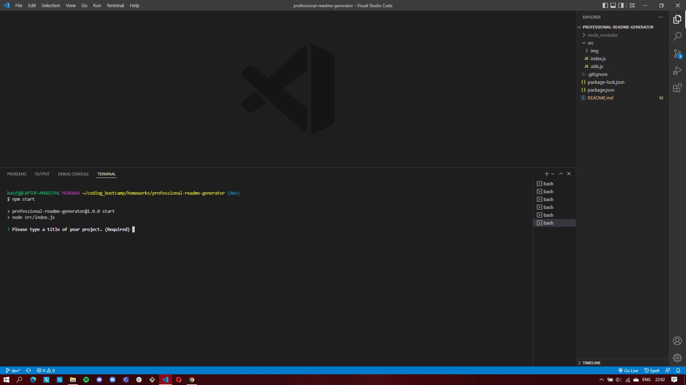

# Professional ReadMe Generator

## Description

This is the command-line application which allows you to quickly and easily generate a readme file using node.js and the inquirer package.
When running the application, the user is presented with a series of prompts in the CLI, asking for information about their project then a high-quality, professional README.md is generated with the title of my project and sections entitled Description, Table of Contents, Installation, Usage, License, Contributing, Tests, and Questions.

## Installation

### Follow these steps on your local machine in order to see how the project works by cloning the repository onto your local machine then go to the project file and then in the terminal install all the dependencies required for the project.

```
git clone git@github.com:katarzynajk/professional-readme-generator.git

cd professional-readme-generator

npm install
```

## Usage

### Using the terminal type the below command to run the application.

```
npm start
```

## Video Link

### Watch the video walk-through of the application [CLICK](https://www.loom.com/share/a345e659d9cb45caad727fd78b42cab5)

## Screenshots

### Start of the application



### Questions appearing in the terminal

.png>)

### The readme which is generated

.png>)

## Contact Me

Contact me via email [CLICK](kat.d.jaromin@gmail.com)
<br>
Contact me via GitHub [CLICK](https://github.com/katarzynajk)
<br>
Contact me via LinkedIn [CLICK](https://www.linkedin.com/in/katarzyna-jaromin-kaliciak-b281b5234/)
